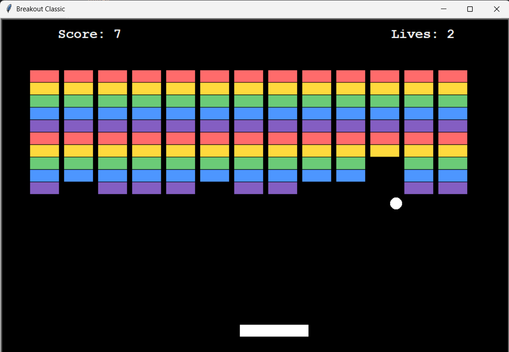

# 🎮 Breakout Classic

A simple and polished remake of the classic Breakout game built in Python using the `turtle` graphics module.



## 🚀 Features

- 🎨 Color-coded bricks 
- 🧱 Fully filled brick wall (no gaps)
- 🕹️ Paddle movement with keyboard
- 🧠 Simple collision physics
- ❤️ Lives and scoring system
- 📱 Responsive layout for 800x600 window

## 🛠️ How to Run

1. Clone this repo
````` 
   git clone https://github.com/yourusername/breakout-game.git
   cd breakout-game
`````

2. Run
 ````
python main.py
````
## ✅ Requirements

- Python 3.9+

- No external libraries required (only built-in turtle)